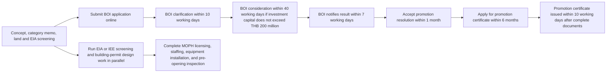

# BOI Pitch and Project Structure for a Phuket Health Rehabilitation Center

## Executive Summary

For a project in entity["city","Phuket","Phuket Province, Thailand"], the cleanest route with the entity["organization","Office of the Board of Investment","Thailand investment promotion agency"] in entity["country","Thailand","Southeast Asian country"] is to present the facility as a physician-led, inpatient post-acute medical recovery business under activity **2.2.2.2 Health rehabilitation center**, not as a spa retreat, a senior residence, or a broad acute hospital. BOI’s published criteria for this activity are narrow but strict: at least **THB 30 million** of investment excluding land and working capital, **medical technology** for treatment and rehabilitation, and **continuous rehabilitation programs including overnight treatment**; **narcotic drug therapy is expressly excluded**. BOI classifies this activity in **Group B**, so the investor narrative should not rely on a corporate income tax holiday as the core attraction. citeturn39view0turn10view0

Your **THB 200 million** budget comfortably clears the BOI minimum, and it does **not** hit the BOI checklist threshold where a project above **THB 2 billion** must attach a feasibility study. The harder problem is **category discipline**. If the proposal drifts into **senior/dependent care**, BOI’s published rules require at least **51% Thai shareholding** and **more than 31 beds**. If it drifts into **hospital** territory, BOI’s hospital category starts at **more than 31 beds** and triggers a different regulatory and incentive logic. In Phuket, this becomes even more strategic because the official EIA rules require environmental review for hospitals or medical facilities at **30 inpatient beds or more** if the site is within **50 meters of the seashore, lake, or beach**, and at **60 inpatient beds or more** for other sites. For that reason, a **24–29 bed opening phase** is often the cleanest coastal structure for a rehab-center filing, while a **30–31 bed model** works better on a non-coastal parcel if you want more inpatient capacity without drifting into the published BOI hospital threshold. citeturn40view0turn39view3turn46view0

The proposal will gain traction if it is framed around **physician-led multiday recovery pathways** rather than “wellness.” The strongest programs for BOI and investor review are typically post-orthopedic surgery recovery, stroke/neuro rehabilitation, post-ICU deconditioning, spine and pain restoration, and other cases that clearly require physician supervision, nursing observation, therapy intensity, medication management, nutrition, and discharge planning. That framing is more consistent with BOI’s “medical technology + continuous rehab + overnight” test and with the service categories recognized under Thailand’s medical-facility rules, which explicitly cover inpatient nursing, physical therapy, occupational therapy, clinical psychology, pharmacy, and related medical services. It also fits Thailand’s cabinet-backed Medical Hub policy and BOI’s own healthcare materials, which report more than **three million foreign patients in 2024** and show **Phuket** among provinces with BOI-promoted medical-service precedents. citeturn39view0turn15view0turn45search7turn11view0turn10view0

There is **no single, official, activity-specific BOI “success rate”** published for Health Rehabilitation Centers in the sources reviewed. BOI instead publishes separate series for **applications, approvals, and certificates**, and BOI has separately stated that **promotion-certificate statistics are the closest public proxy to actual investment**. For decision-making, the more useful benchmark is not a headline ratio but a hand-built comparable set from the BOI promoted-company database, cross-checked against medical licenses, environmental filings, land status, and local permit readiness. citeturn7search3turn9search0turn7search8turn35view0

**Assumptions used in this report**

- Ownership is **not yet fixed**. This report assumes a BOI-eligible juristic vehicle whose final shareholding will be structured after review of BOI foreign-shareholding rules and any sector-specific constraints. citeturn44search0  
- Land control is **not yet finally locked**. This report assumes title, zoning, coastal setback, EIA exposure, and lease/ownership structure still require due diligence with the land and local authorities. citeturn26search7turn23search1  
- The planning base case is a **focused inpatient rehabilitation center** with **28 beds**, plus day-rehab and outpatient follow-up, **without** an operating theater or ICU. That is a strategic design assumption, not a statutory minimum, chosen to stay clearly inside the published rehab-center concept while managing EIA and hospital-classification risk. citeturn39view3turn46view0

## BOI Qualification Strategy and Project Structure

### The core qualification logic

BOI’s public rulebook for this activity is function-based rather than inventory-based. In practice, that means reviewers will judge whether the project is **really a medical rehabilitation business** and not a disguised resort, hotel, elder residence, or outpatient wellness center. The file should therefore answer five questions very clearly: what the patients are recovering from, why they need physician-led rehab, why they need to stay overnight, what medical technologies are on site, and how any non-promoted hospitality/wellness revenue is separated. citeturn39view0turn45search5

| Qualification gatekeeper | BOI-ready answer | What to attach in the application package |
|---|---|---|
| Activity classification | File as **2.2.2.2 Health rehabilitation center** | Short category memo comparing rehab center vs hospital vs senior/dependent care vs wellness/spa |
| Clinical identity | Position as **post-acute / post-surgical / physician-led recovery** | Clinical pathways, admission criteria, discharge criteria |
| Overnight treatment | Make overnight care **clinically necessary**, not hotel-like | Bed schedule, nurse station, daily therapy timetable, physician-rounding plan |
| Medical technology | Show treatment-grade rehab equipment, monitoring, emergency readiness, EMR | Machinery list, vendor quotations, catalogs, room-by-room equipment schedule |
| Ownership logic | If foreign-majority ownership is contemplated, avoid drifting into senior/dependent-care classification | Legal memo on shareholding and promoted activity fit |
| Bed count and site | Use opening scale strategically based on site and EIA exposure | Parcel map, coastal distance check, EIA screening memo |
| Budget fit | Show counted BOI investment separately from land, working capital, and non-promoted fit-out | Capex schedule split into promoted and non-promoted buckets |
| Non-promoted activities | Spa, retail, hotel companion rooms, wellness memberships, beauty, and similar items must be ring-fenced | Separate floor plan, cost centers, revenue codes, lease/service allocations |

*Source note:* The BOI gatekeepers above are built from the official BOI criteria for Health Rehabilitation Center, the adjacent BOI categories for Hospital and Senior/Dependent Care Center, the official BOI foreign-shareholding rules, and the official EIA thresholds for medical facilities. citeturn39view0turn39view3turn44search0turn46view0

### How the THB 200 million budget fits

On the published BOI criteria, **only THB 30 million** of counted investment is needed for this activity, excluding land and working capital. That means a **THB 200 million** project is not borderline; it is structurally more than enough, provided the capital plan is presented correctly. The file should split the budget into: promoted medical fit-out and equipment; core building works attributable to the rehab center; IT/EMR and operational systems; and clearly non-promoted items such as hotel-style accommodation, general wellness retail, or companion amenities. At the same time, the BOI checklist confirms that only projects above **THB 2 billion** need a mandatory feasibility-study attachment, so your project can remain relatively lean in formal filing requirements while still submitting an investor-grade business case voluntarily. citeturn39view0turn40view0

A good investor and BOI presentation will therefore show **two capital views** side by side:

- a **BOI-counted investment view** for promoted qualification; and  
- a **full project-cost view** for investors and lenders.

That split is important because it prevents later confusion over what is promoted, what is merely adjacent, and what is not part of the medical-rehabilitation activity at all. citeturn39view0turn40view0

### Recommended opening configuration

The opening structure below is the cleanest for a Phuket rehab-center filing:

- **Base case for a coastal or resort-like site:** 24–29 inpatient rehab beds, day-rehab gym, outpatient clinic, no operating theater, no ICU.  
- **Base case for an inland site with stronger referral flow:** 30–31 inpatient rehab beds, day-rehab, outpatient follow-up, still no broad acute-hospital positioning.  
- **Escalation case:** if the commercial model really needs 32+ beds and a wider medical scope, evaluate whether the actual project is more honestly a BOI **hospital** application rather than forcing a rehab-center narrative.  

This is the single most important structural decision because it affects BOI category clarity, EIA exposure, local permitting complexity, and investor expectations around tax incentives. citeturn39view3turn46view0

### Indicative BOI application timeline

BOI allows a project to be filed **before the company is formed**, but the company must be established before the promotion certificate is issued. Standard investment-promotion applications are submitted through the BOI e-Investment Promotion system, and incomplete applications are returned for correction with **30 calendar days** to fix the file before rejection. citeturn23search5turn7search2turn7search4turn50view0

The official BOI process for a project with investment capital **not exceeding THB 200 million** is summarized below. The local permitting and EIA workstreams should run in parallel rather than after BOI approval. citeturn43view0turn50view0

### Minimum medical technology and equipment list

BOI does **not** publish a public inventory checklist for activity 2.2.2.2. The official wording is functional: the project must have “medical technology for medical treatment and health rehabilitation.” The recommended list below is therefore not a statutory minimum; it is the **minimum evidentiary package** that makes the BOI file look unmistakably medical, medically supervised, and overnight-capable. The structure is grounded in BOI’s published rehab-center test and in the recognized medical-service categories under Thailand’s medical-facility rules. citeturn39view0turn15view0

| Area | Recommended minimum medical technology / equipment | Why it matters in a BOI file |
|---|---|---|
| Inpatient rooms and nursing | Hospital beds, basic bedside monitoring, nurse-call system, medication carts, oxygen/suction access, pressure-relief support surfaces | Proves this is admitted-patient care, not hotel accommodation |
| Medical examination and triage | Physician exam rooms, ECG, point-of-care diagnostics, basic emergency drugs and crash cart, AED, transfer protocol | Shows clinical oversight and medical-risk management |
| Physical therapy gym | Treatment plinths, therapy bikes, treadmills, resistance equipment, transfer aids, tilt table, therapy stairs | Core evidence of active rehabilitation |
| Gait and balance rehab | Parallel bars, balance training systems, gait aids, body-weight support or advanced gait tools if budget allows | Differentiates serious rehab from a generic fitness room |
| Electrotherapy and modality room | TENS/NMES/FES, therapeutic ultrasound, diathermy, laser or shockwave if clinically justified | Maps directly to recognized PT service modalities |
| Occupational therapy and ADL training | Hand therapy tools, fine-motor rehab, adaptive devices, simulated bathroom/kitchen/bedroom ADL area, cognitive rehab tools | Supports functional-restoration claims |
| Neuro / speech / swallowing | Speech and swallow assessment tools, cognitive screening tools, treatment room; FEES or referral agreement if neuro programs are core | Strengthens stroke/neuro and post-ICU pathways |
| Hydrotherapy, if included | Therapy pool, lift/hoist, infection-control plan, medical supervision protocols | Must look like supervised rehab, not leisure wellness |
| Pharmacy and medication management | Licensed pharmacy room, storage, dispensing and medication-administration processes | Supports inpatient continuity and overnight stays |
| Digital systems | EMR/HIS, therapy documentation system, outcomes tracking, discharge planning, tele-follow-up | BOI reviewers respond well to care-process discipline and measurable outcomes |

### Staffing requirements

The BOI and MOPH sources reviewed do not publish a single public headcount formula for Health Rehabilitation Centers. The table below is therefore a **recommended opening team** for a **28-bed** inpatient rehabilitation center with day-rehab and outpatient follow-up. The principle is to make the project look clinically coherent, 24/7 safe, and license-ready. citeturn39view0turn15view0

| Role | Suggested opening range | Qualification note |
|---|---|---|
| Medical director / PM&R physician | 1 | Should visibly own clinical model, protocols, and BOI pitch |
| Additional physician coverage | 1–2 | Internal medicine, family medicine, neurology, orthopedics, or contracted specialist coverage depending programs |
| Registered nurses | 10–14 | Supports 24/7 inpatient nursing and admission/discharge continuity |
| Nurse aides / patient care assistants | 8–12 | Supports rehabilitation, transfer, and overnight observation |
| Physical therapists | 5–6 | Core production team for most programs |
| Occupational therapists | 2–3 | Essential for ADL, neuro, upper-limb, and discharge-readiness work |
| Speech / swallowing therapist | 1 | Strongly recommended if stroke, neuro, or post-ICU programs are core |
| Clinical psychologist | 1–2 | Supports adjustment, cognition, pain, adherence, and recovery outcomes |
| Pharmacist | 1 | Important for inpatient and discharge medication workflows |
| Dietitian / nutritionist | 1 | Needed for sarcopenia, stroke, post-op, metabolic, and oncology-supportive pathways |
| Case manager / discharge planner | 1–2 | Critical for referral management and family discharge planning |
| QA / infection-control lead | 1 | Strengthens licensing and investor confidence |
| Medical records / front office / scheduling | 2–3 | Supports auditability and payer/referral workflows |

Foreign clinicians should **not** be assumed to be automatically practice-ready. The official HSS material reviewed states that foreign doctors who wish to provide services in Thai medical facilities must first obtain the relevant **Thai professional license** before being allowed to practice. Use the BOI foreign-expert route for immigration and work-permit facilitation, but treat licensure as a separate professional hurdle. citeturn29search7turn23search13

### Sample program menu

The best BOI-facing program menu avoids vague “wellness reset” language and instead shows multiday, diagnosis-driven pathways with treatment intensity, measurable recovery goals, and discharge planning. citeturn39view0turn15view0

| Program | Target patient | Typical duration | Core medical components |
|---|---|---|---|
| Post-orthopedic surgery recovery | Joint replacement, fracture repair, ligament reconstruction, spine surgery | 7–21 days | Physician review, pain management, wound review, PT, gait training, OT, medication, nutrition |
| Stroke and neuro rehabilitation | Stroke, neurological deficit, mobility or swallowing impairment | 14–45 days | Physician-led neuro-rehab plan, PT, OT, speech/swallow therapy, psychology, nursing, discharge planning |
| Post-ICU / medical deconditioning recovery | Critical illness survivors, prolonged bed rest, pulmonary weakness | 7–21 days | Medical monitoring, early mobilization, pulmonary rehab, nutrition, psychology, medication-management |
| Spine, musculoskeletal and pain restoration | Non-surgical or post-procedure spine and chronic pain patients | 5–14 days | Physician review, PT modalities, movement retraining, psychology, education, home program |
| Oncology-supportive rehabilitation | Cancer patients with weakness, lymphedema, mobility decline, treatment fatigue | 5–14 days | Physician oversight, fatigue management, PT/OT, nutrition, edema management, psychology |
| Long-stay medical traveler recovery package | Thai or international patients referred after surgery elsewhere | 7–21 days | Admission assessment, nursing, PT/OT, medication management, tele-follow-up, referral-back protocol |

### Overnight-treatment justification

BOI requires **continuous rehabilitation programs, including overnight treatment**. The safest interpretation is that overnight stay should be justified on medical grounds, not hospitality grounds. In the proposal, the “overnight” case should therefore be framed around daily therapy intensity, nursing observation, medication administration, fall risk, care coordination, and discharge readiness. That means the patient is admitted because the therapy package is **multiday and medically supervised**, not because the center is selling a resort stay. citeturn39view0turn15view0

A strong justification memo should make these points explicitly:

- patients need **serial therapy blocks** across days rather than one-off sessions;  
- inpatient nursing and medication reconciliation are required for some cohorts;  
- some programs need close monitoring for falls, swallowing, wound recovery, or deconditioning;  
- the facility manages handoff from acute hospitals to lower-intensity recovery and then back to home or hotel;  
- admitted stays are tied to clinical criteria, daily progress notes, and discharge criteria.

### Separation of promoted and non-promoted activities

This is one of the most common BOI and investor weak points in mixed-use health projects. Thailand’s regulatory structure distinguishes between **medical facilities** and **health establishments** such as spa and massage businesses. If you want the center promoted as a BOI health rehabilitation project, anything that looks like spa, beauty, hotel, retail, or lifestyle leisure should either be excluded or set up as a clearly separate non-promoted activity. citeturn45search1turn45search5turn39view3

| Promoted activity bucket | Non-promoted or separately ring-fenced bucket | Recommended separation method |
|---|---|---|
| Physician consults, inpatient rehab beds, PT/OT/ST, nursing, clinical psychology, pharmacy, medical diagnostics directly tied to rehab | Spa and massage services, beauty/aesthetic services, hotel-style companion rooms, general gym memberships | Separate rooms, signage, staff roster, cost centers, billing codes, and management reporting |
| Medical traveler recovery packages tied to physician-led rehab | Leisure retreat packages, beach holiday packages, wellness-only detox packages | Separate package names, separate brochures, separate revenue lines |
| Nutrition as part of physician-led rehab care | Retail F&B, cafe revenue, supplements sold to general public | Separate POS and inventory |
| Medically necessary hydrotherapy | Recreational pool use, resort amenities | Physical separation, physician prescription requirement |
| Any Thai traditional medicine component that is medically supervised and lawfully licensed as part of the medical pathway | Standalone Thai massage / wellness business under health-establishment regulations | Separate license path unless independently promoted |

### Likely BOI questions and suggested answers

| Likely BOI question | What BOI is really testing | Suggested answer structure |
|---|---|---|
| Why is this a Health Rehabilitation Center and not a spa or hotel? | Category authenticity | Define target diagnoses, physician governance, therapy timetable, inpatient criteria, and medical technologies; state clearly that wellness and hospitality are non-promoted or excluded |
| Why is overnight stay necessary? | Compliance with the published criterion | Show 7–21+ day pathways, daily therapy blocks, nursing observation, medication management, and discharge planning |
| What medical technologies are on site? | Seriousness of the medical model | Attach a room-by-room equipment schedule and vendor list, not just slogans |
| Why this bed count? | Category clarity and permit logic | Explain whether the chosen bed count is driven by coastal EIA exposure, hospital-threshold avoidance, phased demand ramp, or all three |
| Are you actually running eldercare? | Misclassification risk | State that the center is diagnosis-based, recovery-oriented, time-bounded, and discharge-driven, not a long-stay dependent-care residence |
| How is non-promoted revenue controlled? | Abuse of BOI privileges | Show separated floor plans, accounting codes, legal entities if needed, and management reporting |
| What is your patient source? | Commercial viability | Present referral MOUs, target hospital relationships, insurer discussions, self-pay channels, and international recovery pathways |
| What licenses and approvals are required? | Execution realism | Present the authority map, critical path, land/EIA screening note, and responsible owner for each permit |

A BOI file becomes materially stronger when these answers are supported by **appendices**, not just slide claims: service procedures, machinery lists, photos/catalogues, staffing org chart, land-doc summary, and permit tracker. Those items mirror the document types BOI explicitly asks applicants to provide. citeturn40view0turn50view0

## BOI Pitch Deck Outline

The most persuasive BOI deck is not a generic investor deck with a few incentive slides added. It should be a **BOI-first category proof deck** that also happens to satisfy investors. The table below is designed around the official BOI rehab-center criteria, the official BOI healthcare policy materials, and Phuket’s official precedent signal in recent BOI healthcare presentations. citeturn39view0turn10view0turn11view0turn45search7

| Recommended slide title | Recommended points to make | Suggested visuals / data |
|---|---|---|
| Project at a glance | • Legal entity and sponsor overview • Phuket location and land status • Planned bed count and therapy capacity • THB 200M project size • Requested BOI activity: 2.2.2.2 | One-page summary dashboard; capex headline; site map |
| Why Phuket | • International-access location • Recovery-friendly destination environment • Existing BOI medical-service precedent in Phuket • Fit with longer-stay medical tourism and recovery demand | Phuket map with airport / hospital / hotel corridor; referral catchment map |
| Why this fits BOI Health Rehabilitation Center | • THB 30M minimum is met • Medical technology is central • Continuous rehab programs are core • Overnight treatment is clinically necessary • Narcotic-drug therapy is excluded | BOI category matrix: rehab center vs hospital vs senior/dependent care vs spa |
| Demand and referral traction | • Target cohorts: post-orthopedic, neuro, post-ICU, spine/pain, oncology support • Hospital-referral model • International patient transfer model • Domestic self-pay / insurer channels • Expected ramp and occupancy assumptions | Referral funnel chart; indicative volumes by program; letters of intent snapshot |
| Clinical model and patient journey | • Admission criteria • Daily therapy intensity • Physician rounds and nursing coverage • Discharge planning and tele-follow-up • Outcome measurement | Patient journey graphic from referral to discharge |
| Facility and inpatient design | • Bed mix and nurse station layout • Therapy gym, OT/ADL rooms, consult rooms, pharmacy • Distinct promoted vs non-promoted zones • Safety, accessibility, and transfer flow | Floor plan with colored zones; room stack diagram |
| Medical technology and digital systems | • Key rehab and inpatient equipment • Monitoring and emergency readiness • EMR / outcomes tracking • Vendor readiness and procurement sequencing | Equipment board; room-by-room equipment matrix; IT architecture |
| Clinical team and governance | • Medical director and rehab team • Staffing by shift and by discipline • Thai-license compliance and foreign-expert plan • QA / infection control / case management | Organizational chart; staffing heat map by function |
| Capital plan and economics | • Full THB 200M capex plan • BOI-counted vs non-counted investment • Revenue by program • Occupancy and LOS logic • Cash-flow story without tax-holiday dependence | Capex pie chart; phased ramp chart; simple unit-economics chart |
| Regulatory readiness and application path | • BOI sequence and deadlines • Local health-license path • EIA screening logic by site and bed count • Building permit and land documents • Critical path and owners | Mermaid timeline; permit matrix; red-amber-green tracker |
| Thailand and Phuket public-value case | • Alignment with Thailand Medical Hub strategy • Skilled-job creation • Value-add medical tourism • Referral spillover to local health ecosystem • Compliance and governance commitments | Jobs table; ecosystem map; public-value scorecard |
| Risk controls and execution plan | • Classification risk • Permitting risk • Staffing risk • Demand ramp risk • Mixed-use / non-promoted leakage risk • Contingency plan | Risk heat map; mitigants matrix |

A useful appendix pack behind the slide deck should include: care-pathway drafts; the main machinery schedule; sample physician and clinical-lead CVs; a promoted/non-promoted zoning plan; draft capex allocation; land-title summary; a permit tracker; and any referral or supplier letters of intent. BOI’s own checklist asks for project details, photos/catalogues, service procedures, and main machinery details, so these appendices are directly supportive rather than decorative. citeturn40view0

## Sample Executive Summary

The following text is drafted in the style of a concise executive summary for BOI reviewers and investors.

The proposed project is a **Phuket-based physician-led Health Rehabilitation Center** designed to serve Thai and international patients requiring post-acute and post-surgical medical recovery. The center is structured to fit BOI activity **2.2.2.2 Health Rehabilitation Center** by satisfying the published requirements of at least **THB 30 million** investment excluding land and working capital, deploying **medical technology for treatment and rehabilitation**, and delivering **continuous rehabilitation programs including overnight treatment**. The project budget of **THB 200 million** is comfortably above the published BOI minimum and supports a focused opening model with inpatient rehabilitation beds, day-rehab capacity, and outpatient follow-up. The center is not proposed as a spa, hotel, detox retreat, or long-stay dependent-care residence; rather, it is a medical recovery platform built around diagnosis-based, physician-supervised rehabilitation pathways. citeturn39view0turn40view0

The project’s initial program mix will concentrate on post-orthopedic recovery, stroke and neuro rehabilitation, post-ICU and deconditioning recovery, spine and pain restoration, and selected oncology-supportive rehabilitation services. Each pathway will combine physician oversight, registered nursing, physical and occupational therapy, medication management, nutrition, psychology, and discharge planning. The operating model will emphasize measurable patient outcomes, safety, continuity of care, and referral partnerships with acute-care providers and medical-travel channels. This approach aligns with Thailand’s Medical Hub strategy and with BOI’s health-sector policy emphasis on higher-value medical services, prevention, rehabilitation, and long-term health management. BOI’s recent healthcare presentation also shows Phuket as a province with official medical-service precedents, supporting the location logic. citeturn45search7turn10view0turn11view0

From an investor perspective, the project is designed to create a differentiated niche between acute hospitals and generic wellness properties. The principal value proposition is recovery-oriented medical care in a destination environment, with a defined referral funnel and clearly separated non-promoted activities. Because BOI classifies Health Rehabilitation Center in **Group B**, the business case is presented on its underlying operating merits rather than on an assumed corporate tax holiday. BOI promotion remains strategically valuable, however, for policy alignment and applicable facilitation measures, including the channels related to land rights and foreign experts where relevant to the final promoted structure and certificate conditions. citeturn10view0turn23search1turn23search13

The project team’s immediate next steps are to finalize the category memo, lock a site with a documented coastal and EIA screen, define the opening bed count, complete the room-by-room equipment and staffing plan, separate promoted and non-promoted revenue zones, and prepare the BOI filing package through the e-Investment Promotion system. If executed in that sequence, the project can present a credible, BOI-ready rehabilitation proposition for Phuket rather than a mixed-use concept vulnerable to reclassification or permitting delay. citeturn50view0turn43view0turn32search0turn46view0

## Regulatory and Licensing Map for Phuket

The local Thai counterpart for this project is primarily the entity["organization","Ministry of Public Health","Thailand"], especially the entity["organization","Department of Health Service Support","Thailand"] and the entity["organization","Phuket Provincial Public Health Office","Phuket, Thailand"]. Building and local public-health matters sit with the competent local authority, which could be entity["organization","Phuket City Municipality","Phuket, Thailand"] or another municipality / SAO depending on the parcel. Environmental screening runs through the entity["organization","Office of Natural Resources and Environmental Policy and Planning","Thailand"], and title/lease matters run through the entity["organization","Department of Lands","Thailand"] and the Phuket land office. citeturn28search0turn20search3turn21search0turn26search3

| Authority / agency | What to engage them for | Main permit / output | Indicative timing note |
|---|---|---|---|
| BOI | Promotion application, category positioning, incentives, certificate issuance | BOI promotion approval and promotion certificate | **Official timeline:** clarification within 10 working days; consideration within 40 working days for projects with investment capital not exceeding THB 200M; result notice within 7 working days; acceptance within 1 month; certificate application within 6 months; certificate issuance within 10 working days after complete docs. |
| Department of Business Development | Incorporate company if not already formed; amend structure before certificate stage if needed | Thai juristic person registration | BOI application can be filed before company formation, but the company must be established before the promotion certificate is issued. |
| Department of Health Service Support / Phuket Provincial Public Health Office | Determine facility license path, review medical scope, pre-opening inspection readiness, professional compliance | Medical-facility license / operating authorization | Start this workstream early; the official private-hospital opening guide states building-law compliance and environmental approval, if applicable, must already be in place. |
| Local municipality / SAO / local competent officer | Building permit, building-control compliance, local public-health issues, utilities, occupancy coordination | Construction permit and related local approvals | Start during schematic-to-detailed design. Building-permit packages require land-title evidence and landowner consent if the applicant is not the owner. |
| ONEP / Smart EIA Plus / EIA consultant | Site screening and, if triggered, IEE/EIA filing and review | EIA or IEE approval where legally required | **Official environmental thresholds:** hospitals/medical facilities at 30 beds or more if within 50m of seashore/lake/beach, and 60 beds or more for other sites. Formal EIA review stages in the official guide include 15-day checks and expert-committee reviews of 45 and 30 days, excluding report preparation and revisions. |
| Phuket Land Office / Department of Lands | Title due diligence, lease registration, ownership or BOI land-rights strategy, encumbrance review | Registered title / lease / land-rights documentation | Start before BOI filing if land is unsettled. After promotion, BOI land-rights requests through E-Land show a published processing time of 15 business days. |
| Local public-health authority if pools, kitchen, laundry, wastewater, or similar components are included | Public-health and health-hazardous-business issues | Additional local public-health permits if applicable | Screen at concept stage so that hydrotherapy, kitchens, or laundering do not create surprise local approvals. |

*Source note:* The BOI timing in this table is official. The company-formation point is based on BOI application guidance allowing filing before incorporation but requiring the company before certificate issuance. The medical-facility row is based on the official HSS guide snippet stating that private-hospital opening must also comply with building and environmental law. The land-document point is supported by the BOI business guide’s building-permit documentation list. citeturn43view0turn50view0turn23search5turn7search2turn32search0turn49view0turn46view0turn23search1

A practical sequencing rule follows from the map above: **do not wait for BOI approval to screen the land**. In Phuket, the wrong parcel can move the project onto an EIA critical path very quickly, especially if the concept includes 30 or more beds near the shore. Likewise, **do not finalize the branding as “wellness”** before the MOPH license route is defined, because Thailand’s health-establishment regime is a different legal track from the medical-facility regime. citeturn46view0turn45search1turn45search5

## Comparable Cases and Success-Rate Reality

BOI’s public materials reviewed here do **not** provide a single official “success rate” for BOI Health Rehabilitation Centers. BOI’s statistics pages publish separate tables for promotion applications, approvals, and certificates, and BOI has stated in its public communication that promotion-certificate statistics are the closest indicator to actual investment. That is why a single denominator-based “success rate” would be homemade rather than official. What **is** useful is precedent density: BOI’s 2026 healthcare presentation shows **Phuket** on the map of BOI-promoted **medical centers / medical services** with **3 projects** during the 2020–Q1 2025 period, which is a meaningful signal that Phuket is not an empty market in BOI’s own internal framing. citeturn7search3turn9search0turn7search8turn10view0

### How to extract a reliable comparable list

The official BOI promoted-company database is the correct starting point, but it should be treated as a **screening tool**, not the final truth set. The page reviewed confirms that users can **download Excel files**, up to **200 rows per search**, and that search quality depends heavily on province filters, transliteration, partial strings, and Thai-vs-English spelling variants. The English page also warns that some information may not be supported in the selected language, which is one reason Thai-language searches are often necessary. citeturn35view0

A reliable workflow is:

1. Start with **Province = Phuket** and search English strings such as `rehab`, `rehabilitation`, `recovery`, `medical center`, `hospital`, `wellness`, `senior`, and `therapy`.  
2. Repeat the query in Thai using strings such as `ฟื้นฟู`, `ฟื้นฟูสมรรถภาพ`, `ฟื้นฟูสุขภาพ`, `ศูนย์ฟื้นฟู`, `เวชศาสตร์ฟื้นฟู`, `ศูนย์การแพทย์`, `สถานพยาบาล`, `โรงพยาบาล`, `ดูแลผู้ป่วย`, and `ผู้สูงอายุ`.  
3. Expand to **Bangkok, Chiang Mai, Krabi, Surat Thani, and Songkhla** to build a more robust medical-tourism comparable set if Phuket results are thin. BOI’s healthcare presentation shows these provinces appearing in promoted medical-center/service examples. citeturn10view0  
4. Export the Excel results, then verify each company through medical-license status with the relevant public-health authority and, where relevant, environmental filings and land status. The HSS information materials reviewed confirm that Thailand maintains data on licensed health facilities, and the Phuket Provincial Public Health Office is the correct provincial gateway. citeturn29search2turn28search0  
5. Score each comparable on **similarity**, not just province: physician-led rehab, inpatient capability, post-acute scope, referral model, and separation from wellness/hotel activity.

### Sample search-keyword table

| English search strings | Thai search strings |
|---|---|
| rehab | ฟื้นฟู |
| rehabilitation | ฟื้นฟูสมรรถภาพ |
| recovery | ฟื้นฟูสุขภาพ |
| medical center | ศูนย์การแพทย์ |
| rehab center | ศูนย์ฟื้นฟู |
| physical therapy | กายภาพบำบัด |
| hospital | โรงพยาบาล |
| health rehabilitation | ศูนย์ฟื้นฟูสุขภาพ |
| senior | ผู้สูงอายุ |
| dependent care | ดูแลผู้ป่วยพึ่งพิง |

### Comparable-case template

| Company | Province | BOI activity | Investment amount | Ownership | Medical license | Similarity |
|---|---|---|---|---|---|---|
| [To extract from BOI database] | Phuket | [e.g., medical center / hospital / rehab-related service] | [THB] | [Thai-majority / foreign-majority / unknown] | [Hospital / clinic / health establishment / unknown] | High / Medium / Low |
| [To extract from BOI database] | Phuket |  |  |  |  |  |
| [To extract from BOI database] | Krabi / Chiang Mai / Surat Thani / Bangkok |  |  |  |  |  |
| [To extract from BOI database] |  |  |  |  |  |  |
| [To extract from BOI database] |  |  |  |  |  |  |
| [To extract from BOI database] |  |  |  |  |  |  |

## Risk Checklist and Mitigation Actions

Most BOI objections on mixed-use health projects are not about whether “healthcare is promoted” in the abstract. They are about **misclassification, evidence gaps, and permit realism**. The table below focuses on the objections most likely to arise for a Phuket recovery-center proposal. citeturn39view0turn39view3turn32search0turn46view0turn45search1

| Common BOI or execution risk | Why it matters | Mitigation action |
|---|---|---|
| The project looks like a spa, hotel, or wellness retreat | BOI may not accept it as a medical rehabilitation business | Use physician-led language, diagnosis-driven programs, inpatient nursing, medical equipment schedule, and rehabilitation outcomes from the first slide onward |
| The bed count pushes the project toward hospital or EIA complexity | Bed count affects both classification clarity and environmental review | Choose 24–29 beds for a coastal site or 30–31 beds for inland phase one; if the business really needs 32+ beds, revisit category selection honestly |
| The project sounds like senior housing rather than rehabilitation | Senior/dependent care has different published BOI criteria, including Thai-shareholding rules | Emphasize time-bounded, post-acute recovery and discharge pathways; avoid “residence,” “retreat,” and long-stay living language |
| Non-promoted revenue is mixed into the promoted activity | This creates BOI audit, tax, and credibility problems | Separate spaces, staff, bookkeeping, package names, billing codes, and where needed legal entities |
| Medical technology is under-described | BOI’s public criterion is explicitly technology-based | Attach room-by-room machinery schedule, catalogues, brands, quotations, and installation sequence |
| Overnight treatment is not credibly justified | Overnight care is a published BOI criterion | Document daily therapy intensity, physician rounds, nursing supervision, medication and fall-risk management, and discharge criteria |
| The site later triggers EIA or local environmental conditions | This can become the project’s critical path | Run parcel screening before finalizing the concept; confirm distance from shore and any special-area restrictions early |
| The permitting sequence is unrealistic | BOI reviewers dislike plans that ignore local law dependencies | Show a parallel-track plan: BOI, land/title, design/building permit, EIA screen, MOPH licensing, staffing and equipment |
| The clinical team is not license-ready | Medical projects without real operators lose credibility quickly | Secure LOIs or draft contracts for medical director, rehab leads, pharmacist, and QA lead; confirm Thai licensure needs early |
| Foreign clinicians are assumed to be immediately usable | Immigration facilitation does not equal professional licensure | Separate immigration/work-permit planning from Thai professional-license planning |
| Demand is asserted but not evidenced | Investor and BOI confidence weakens without traction proof | Add referral LOIs, insurer conversations, expected transfer pathways, surgeon/hospital letters, and pre-opening demand interviews |
| The concept includes addiction or narcotic-related rehab | BOI’s published rehab criterion expressly excludes narcotic drug therapy | Exclude narcotic-drug therapy from the BOI-promoted scope unless BOI gives written activity guidance for another category |

One additional practical mitigation is naming. A project called “recovery institute,” “medical recovery center,” or “post-acute rehabilitation center” is usually safer than a project called “wellness resort” or “healing retreat,” because the latter names push the proposal toward the health-establishment / spa side of the regulatory map before BOI even reads the deck. That branding discipline matters. citeturn45search1turn45search5

## Official Sources and Links

- urlBOI Investment Promotion Guide 2025turn5search2 — official BOI activity criteria, including 2.2.2.2 Health Rehabilitation Center and adjacent medical-service categories. citeturn39view0turn39view3  
- urlBOI Health and Wellness Industry presentation 2026turn23search16 — official BOI healthcare incentive grouping and province-level examples for BOI-promoted medical-service projects. citeturn10view0  
- urlBOI Steps to Apply for Promotion infographicturn1search1 — official BOI step-by-step process and published timing windows. citeturn43view0  
- urlBOI e-Investment Promotion systemturn7search4 — official online application channel and correction rules for incomplete submissions. citeturn50view0  
- urlBOI document checklist for applicationsturn40view0 — official filing checklist, including project details, service procedures, machinery, and the >THB 2 billion feasibility-study trigger. citeturn40view0  
- urlBOI Promoted Company Databaseturn0search1 — official promoted-company search/export tool with province filter, spelling guidance, and Excel export limit. citeturn35view0  
- urlBOI foreign-shareholding criteriaturn44search0 — official BOI summary of foreign-shareholding rules. citeturn44search0  
- urlBOI land ownership after promotionturn23search1 — official BOI land-rights process and published 15-business-day processing time. citeturn23search1  
- urlBOI procedure to bring in foreign expertsturn23search13 — official BOI visa/work-permit facilitation route for promoted projects. citeturn23search13  
- urlThailand Medical Facilities Act compilation by HSSturn12search0 — official MOPH/HSS legal material relevant to inpatient nursing, PT, OT, pharmacy, radiology, and clinical psychology services. citeturn15view0  
- urlPhuket Provincial Public Health Officeturn28search0 — official provincial public-health authority for Phuket-side coordination. citeturn28search0turn28search9  
- urlPhuket City Municipalityturn20search3 — official local authority website for municipal coordination where the parcel falls in its jurisdiction. citeturn20search3  
- urlSmart EIA Plusturn21search0 — official ONEP environmental-reporting portal. citeturn21search0turn46view0  
- urlONEP EIA information pageturn21search6 — official environmental-assessment overview. citeturn21search6turn21search8  
- urlPhuket Land Officeturn26search3 — official land-office contact page and land-transaction guidance. citeturn26search5turn26search7  
- urlBOI Healthcare and Wellness Industry brochureturn0search2 — official BOI sectoral brochure citing foreign-patient volume and health-sector market context. citeturn11view0